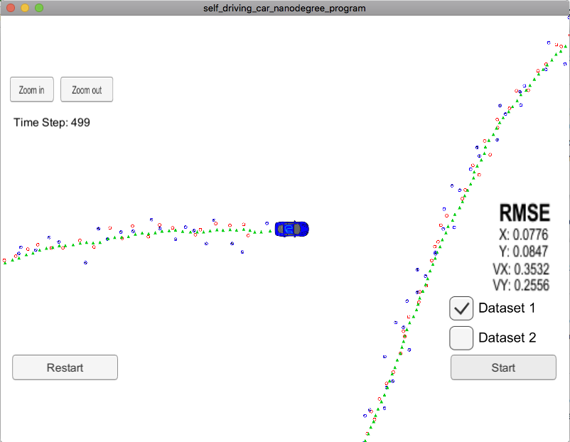

# UKF Project Writeup

This project uses the provided template, and UKF code developed during the video lectures.

`ukf.cpp` implements a sensor fusion algorithm that selects the proper UKF initialization, update and prediction functions for the given data types.

`tools.cpp` contains tools for converting between cartesian and polar coordinate systems as well as calculating the RMSE

## Comments on Code

I basically followed the code developed during the video lectures. Here are some aspects that needed to be addressed beyond this.

### Filter Initialization and Tuning

- initial state `x_` : was initialized to 0, since this is all I can assume. It is later updated with the first measurement (see below)
- coviariance Matrix `P_`: was initialized as
```
P_ << std_laspx_,0,0,0,0,
      0,std_laspy_,0,0,0,
      0,0,1,0,0,
      0,0,0,1,0,
      0,0,0,0,1;
```
Since leaving it as a unit matrix made the RMSE higher. A further improvement to experiment with would be to fill the lower rows with `std_radr_, std_radphi_` and `std_radrd_`, but the results were good enough to satisfy the assignment requirements.
- tuning `std_a_`: the initial value was too high, so not achievable by a bicycle. Therefore, I reduced the value to 1.0 m/s^2, which would be a great acceleration for a bike.
- tuning `std_yawdd_`: this value also seemed high for a bike following usual traffic. Therefore, I reduced the value to 0.2 rad/s^2

### State Initialization

My UKF implementation initializes its state `x_` upon reading the first measurement. LIDAR provides `px` and `py` directly, and these values can be derived from RADAR measurements' distance and angle. I did not use radar speed (`d_dot`) estimates, as these are values relative to the vehicle, which actually depend on `x_` being known to an acceptable degree of certainty.

### LIDAR Update

LIDAR updates were not developed in the lecture, so I had to adjust the code from RADAR updates. This was simple and basically amounted to reducing `n_z` to 2 and removing angle normalization code.

### Code Organization and Future Improvements

The code right now is pretty much linearly follows the example code from the video lectures. The code could in future be organized in a more maintainable way with individual methods for the phases of the filter (i.e., Augmented Sigma Points, Sigma Point Prediction, Mean and Covariance Prediction, Measurement Prediction, RADAR/LIDAR Updates).

I did try to remove redundant code so basically RADAR and LIDAR updates only differ in the Update Steps, where there is an individual method.

I wrote methods for often-used code for mapping the process model (`mapProcessModel`) and converting state to measurement space for LIDAR (`TransformToLidarMeasurement`) and RADAR  (`TransformToRadarMeasurement`).

### Pitfalls and Caveats
- it is important to initialize `Eigen` Matrices with `fill(0.0)` to avoid random filter outputs and `NaN`values
- angle normalization and division by 0 checks are important!

## Filter Performance

The final filter RMSE on Dataset1 with both RADAR and LIDAR measurements is: 0.0776, 0.0847, 0.3532, 0.2556, which is better than my final results for the EKF.

Here is an image of the final output:


